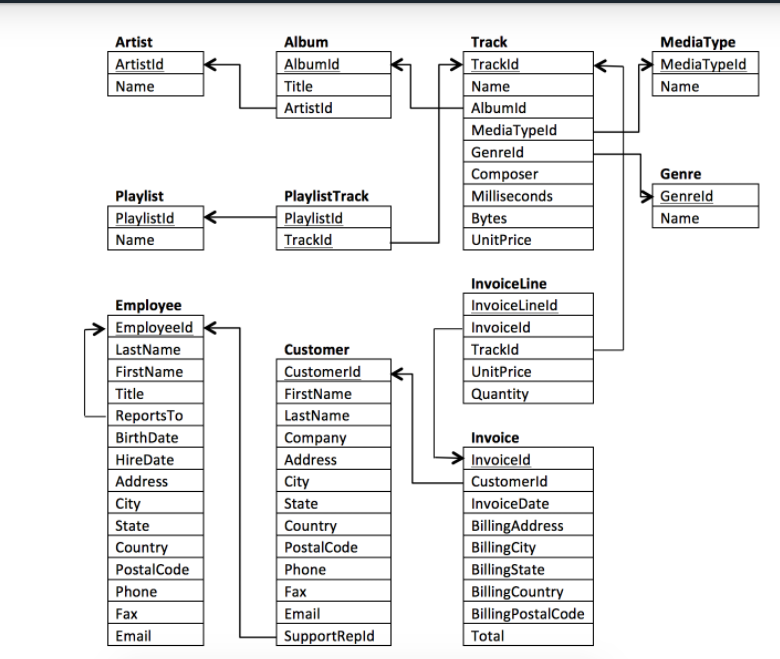

# Chinook Database
The Chinook Database holds information about a music store. For this project, you will be assisting the Chinook team with understanding the media in their store, their customers and employees, and their invoice information. To assist you in the queries ahead, the schema for the Chinook Database is provided below. You can see the columns that link tables together via the arrows.

## Data Model
The Chinook data model represents a digital media store, including tables for artists, albums, media tracks, invoices and customers.

## Sample Data
Media related data was created using real data from an iTunes Library.  Customer and employee information was manually created using fictitious names, addresses that can be located on Google maps, and other well formatted data (phone, fax, email, etc.). Sales information is auto generated using random data for a four year period.

## Why the name Chinook?
The name of this sample database was based on the Northwind database. Chinooks are winds in the interior West of North America, where the Canadian Prairies and Great Plains meet various mountain ranges. Chinooks are most prevalent over southern Alberta in Canada. Chinook is a good name choice for a database that intents to be an alternative to Northwind

## How do I Download and Create the Chinook Database?
Download the files from the Downloads page. It is provided one or more SQL script file for each database vendor supported. You can run these SQL scripts with your preferred database tool
For SQL Server, Oracle, MySQL and SQLite, there are available batch files that will execute the respective SQL script(s). These batch files use the database server command tool (mysql.exe for MySQL, sqlcmd.exe for SQL Server, sqlplus.exe for Oracle, and sqlite3.exe for SQLite). It is recommended to open a Command Prompt window as Administrator in order to run these batch files.

For embedded databases, SQLite and SQL Server Compact, it is also provided the embedded database files in addition to the SQL script files.

Notes:

* MySQL
  * Tested with MySQL Server 5.1.
  * The CreateMySql.bat script uses localhost server with the following user/password: root/p4ssw0rd. Change this file to match your settings before running it.
* Oracle
  * Tested with Oracle Database 10g Express Edition (XE).
  * The CreateOracle.sql creates a new user/password: chinook/p4ssw0rd. Change this script if you want a different user/password.
* SQL Server
  * Tested with SQL Server Express 2008.
* SQL Server Compact
  * Tested with SQL Server Compact 3.5 SP1.
  * We included the compact databases (sdf files) using version 3.5.8080.0. If you prefer to create your own compact database, then you can use the .sqlce script with SQL Server Management Studio Express tool.
* SQLite
  * Tested with SQLite 3.7.3

## Project requirements

You need to come up with 4 questions that you can answer with SQL. The questions must be complex enough to where the SQL used to answer it requires at least one JOIN and one Aggregation.
